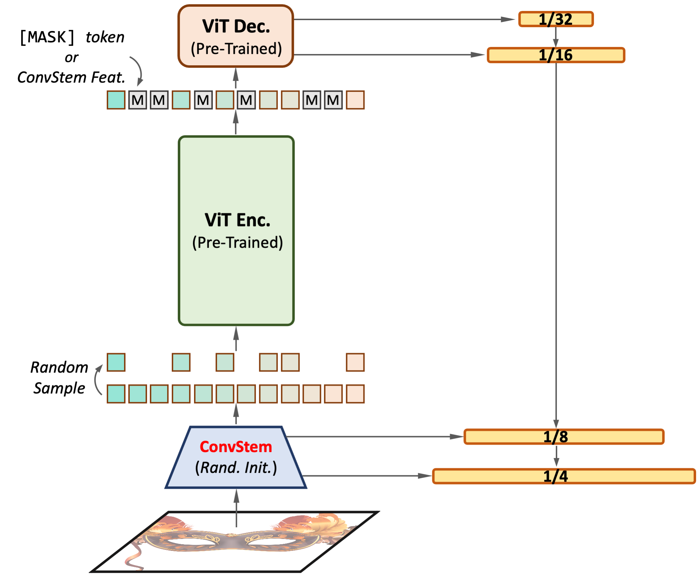

<div align="center">
<h1>MIMDet &#127917;</h1>
<h3>Unleashing Vanilla Vision Transformer
with Masked Image Modeling for Object Detection</h3>


[Yuxin Fang](https://bit.ly/YuxinFang_GoogleScholar)<sup>1</sup> \*, [Shusheng Yang](https://scholar.google.com/citations?user=v6dmW5cntoMC&hl=en)<sup>1</sup> \*, [Shijie Wang](https://github.com/simonJJJ)<sup>1</sup> \*, [Yixiao Ge](https://geyixiao.com/)<sup>2</sup>, [Ying Shan](https://scholar.google.com/citations?user=4oXBp9UAAAAJ&hl=en)<sup>2</sup>, [Xinggang Wang](https://xinggangw.info/)<sup>1 :email:</sup>,
 
<sup>1</sup> [School of EIC, HUST](http://eic.hust.edu.cn/English/Home.htm), <sup>2</sup> [ARC Lab, Tencent PCG](https://arc.tencent.com/en/index).

(\*) equal contribution, (<sup>:email:</sup>) corresponding author.

ArXiv Preprint ([arXiv 2204.02964](https://arxiv.org/abs/2204.02964))

</div>

# 

### News

* **`19 May, 2022`:** We update our [preprint](https://arxiv.org/abs/2204.02964v2) with stronger results and more analysis. Code & models are also updated in the [`main`](https://github.com/hustvl/MIMDet/tree/main) branch. For our previous results (code & models), please refer to the [`v1.0.0`](https://github.com/hustvl/MIMDet/tree/v1.0.0) branch.

* **`6 Apr, 2022`:** Code & models are released!

## Introduction


<p align="center">

</p>

This repo provides code and pretrained models for **MIMDet** (**M**asked **I**mage **M**odeling for **Det**ection).
* MIMDet is a simple framekwork that enables a MIM pretrained vanilla ViT to perform high-performance object-level understanding, e.g, object detection and instance segmentation.
* In MIMDet, a MIM pre-trained vanilla ViT encoder can work surprisingly well in the challenging object-level recognition scenario even with randomly sampled *partial* observations, e.g., only 25%~50% of the input embeddings.
* In order to construct multi-scale representations for object detection, a *randomly initialized* compact convolutional stem supplants the pre-trained large kernel patchify stem, and its intermediate features can naturally serve as the higher resolution inputs of a feature pyramid without upsampling. While the pre-trained ViT is only regarded as the third-stage of our detector's backbone instead of the whole feature extractor, resulting in a ConvNet-ViT *hybrid* architecture.
* MIMDet w/ ViT-Base & Mask R-CNN FPN obtains **51.7 box AP** and **46.2 mask AP** on COCO. With ViT-L, MIMDet achieves **54.3 box AP** and **48.2 mask AP**.
* We also provide an unofficial implementation of [Benchmarking Detection Transfer Learning with Vision Transformers](https://arxiv.org/abs/2111.11429) that successfully reproduces its reported results.

## Models and Main Results

### Mask R-CNN
| <sub>Model | <sub>Sample Ratio | <sub>Schedule | <sub>Aug | <sub>Box AP | <sub>Mask AP | <sub>#params | <sub>config | <sub>model / log |
| :---: | :---: | :---: | :---: | :---: | :---: | :---: | :---: | :---: |
| <sub>MIMDet-ViT-B | <sub>0.5 | <sub>3x | <sub>[480-800, 1333] w/crop | <sub>51.7 | <sub>46.2 | <sub>127.96M | <sub>[config](configs/mimdet/mimdet_vit_base_mask_rcnn_fpn_sr_0p5_800_1333_4xdec_coco_3x.py) | <sub>[model](https://github.com/hustvl/Storage/releases/download/v1.2.0/mimdet_vit_base_mask_rcnn_fpn_sr_0p5_800_1333_4xdec_coco_3x.pth) / [log](https://github.com/hustvl/Storage/releases/download/v1.2.0/mimdet_vit_base_mask_rcnn_fpn_sr_0p5_800_1333_4xdec_coco_3x.json) |
| <sub>MIMDet-ViT-L | <sub>0.5 | <sub>3x | <sub>[480-800, 1333] w/crop | <sub>54.3 | <sub>48.2 | <sub>349.33M | <sub>[config](configs/mimdet/mimdet_vit_large_mask_rcnn_fpn_sr_0p5_800_1333_4xdec_coco_3x.py) | <sub>[model](https://github.com/hustvl/Storage/releases/download/v1.2.0/mimdet_vit_large_mask_rcnn_fpn_sr_0p5_800_1333_4xdec_coco_3x.pth) / [log](https://github.com/hustvl/Storage/releases/download/v1.2.0/mimdet_vit_large_mask_rcnn_fpn_sr_0p5_800_1333_4xdec_coco_3x.json) |
| <sub>Benchmarking-ViT-B | <sub>- | <sub>25ep | <sub>[1024, 1024] LSJ(0.1-2) | <sub>48.0 | <sub>43.0 | <sub>118.67M | <sub>[config](configs/benchmarking/benchmarking_mask_rcnn_base_FPN_25ep_LSJ_mae.py) | <sub>[model](https://github.com/hustvl/storage/releases/download/v1.0.0/benchmarking_mask_rcnn_base_FPN_25ep_LSJ_mae.pth) / [log](https://github.com/hustvl/Storage/releases/download/v1.0.1/benchmarking_mask_rcnn_base_FPN_25ep_LSJ_mae.json) |
| <sub>Benchmarking-ViT-B | <sub>- | <sub>50ep | <sub>[1024, 1024] LSJ(0.1-2) | <sub>50.2 | <sub>44.9 | <sub>118.67M | <sub>[config](configs/benchmarking/benchmarking_mask_rcnn_base_FPN_50ep_LSJ_mae.py) | <sub>[model](https://github.com/hustvl/storage/releases/download/v1.0.0/benchmarking_mask_rcnn_base_FPN_50ep_LSJ_mae.pth) / [log](https://github.com/hustvl/Storage/releases/download/v1.0.1/benchmarking_mask_rcnn_base_FPN_50ep_LSJ_mae.json) |
| <sub>Benchmarking-ViT-B |<sub>- | <sub>100ep | <sub>[1024, 1024] LSJ(0.1-2) | <sub>50.4 | <sub>44.9 | <sub>118.67M | <sub>[config](configs/benchmarking/benchmarking_mask_rcnn_base_FPN_100ep_LSJ_mae.py) | <sub>[model](https://github.com/hustvl/storage/releases/download/v1.0.0/benchmarking_mask_rcnn_base_FPN_100ep_LSJ_mae.pth) / [log](https://github.com/hustvl/Storage/releases/download/v1.0.1/benchmarking_mask_rcnn_base_FPN_100ep_LSJ_mae.json) |

**Notes**:

- The Box AP & Mask AP in the table above is obtained w/ sample ratio = 1.0, which is higher than the training sample ratio (0.25 or 0.5). Our MIMDet can benefit from lower sample ratio during training for better efficiency, as well as higher sample ratio during inference for better accuracy. Please refer to our paper for detailed analysis.
- Benchmarking-ViT-B is an unofficial implementation of [Benchmarking Detection Transfer Learning with Vision Transformers](https://arxiv.org/abs/2111.11429).

## Installation

### Prerequisites
* Linux
* Python 3.7+
* CUDA 10.2+
* GCC 5+

### Prepare

- Clone
```
git clone https://github.com/hustvl/MIMDet.git
cd MIMDet
```


- Create a conda virtual environment and activate it:
```
conda create -n mimdet python=3.9
conda activate mimdet
```

* Install `torch==1.9.0` and `torchvision==0.10.0`
* Install [`Detectron2==0.6`](https://github.com/facebookresearch/detectron2), follow [d2 doc](https://detectron2.readthedocs.io/tutorials/install.html).
* Install [`timm==0.4.12`](https://github.com/rwightman/pytorch-image-models), follow [timm doc](https://fastai.github.io/timmdocs/).
* Install [`einops`](https://github.com/arogozhnikov/einops), follow [einops repo](https://github.com/arogozhnikov/einops#installation--).
* Prepare [`COCO`](https://cocodataset.org/#home) dataset, follow [d2 doc](https://detectron2.readthedocs.io/en/latest/tutorials/builtin_datasets.html).

### Dataset

MIMDet is built upon ```detectron2```, so please organize dataset directory in detectron2's manner. We refer users to [```detectron2```](https://github.com/facebookresearch/detectron2) for detailed instructions. The overall hierachical structure is illustrated as following:
```
MIMDet
├── datasets
│   ├── coco
│   │   ├── annotations
│   │   ├── train2017
│   │   ├── val2017
│   │   ├── test2017
│   ├── ...
├── ...
```


## Training

Download the ***full*** MAE pretrained (including the decoder) [ViT-B Model](https://dl.fbaipublicfiles.com/mae/pretrain/mae_pretrain_vit_base_full.pth) and [ViT-L Model](https://dl.fbaipublicfiles.com/mae/pretrain/mae_pretrain_vit_large_full.pth) checkpoint. See [MAE repo-issues-8](https://github.com/facebookresearch/mae/issues/8).
```
# single-machine training
python lazyconfig_train_net.py --config-file <CONFIG_FILE> --num-gpus <GPU_NUM> mae_checkpoint.path=<MAE_MODEL_PATH>

# multi-machine training
python lazyconfig_train_net.py --config-file <CONFIG_FILE> --num-gpus <GPU_NUM> --num-machines <MACHINE_NUM> --master_addr <MASTER_ADDR> --master_port <MASTER_PORT> mae_checkpoint.path=<MAE_MODEL_PATH>
```

## Inference

```
# inference
python lazyconfig_train_net.py --config-file <CONFIG_FILE> --num-gpus <GPU_NUM> --eval-only train.init_checkpoint=<MODEL_PATH>

# inference with 100% sample ratio (please refer to our paper for detailed analysis)
python lazyconfig_train_net.py --config-file <CONFIG_FILE> --num-gpus <GPU_NUM> --eval-only train.init_checkpoint=<MODEL_PATH> model.backbone.bottom_up.sample_ratio=1.0
```

## Acknowledgement
This project is based on [MAE](https://github.com/facebookresearch/mae), [Detectron2](https://github.com/facebookresearch/detectron2) and [timm](https://github.com/rwightman/pytorch-image-models). Thanks for their wonderful works.

## License

MIMDet is released under the [MIT License](LICENSE).

## Citation

If you find our paper and code useful in your research, please consider giving a star :star: and citation :pencil: :)

```BibTeX
@article{MIMDet,
  title={Unleashing Vanilla Vision Transformer with Masked Image Modeling for Object Detection},
  author={Fang, Yuxin and Yang, Shusheng and Wang, Shijie and Ge, Yixiao and Shan, Ying and Wang, Xinggang},
  journal={arXiv preprint arXiv:2204.02964},
  year={2022}
}
```
